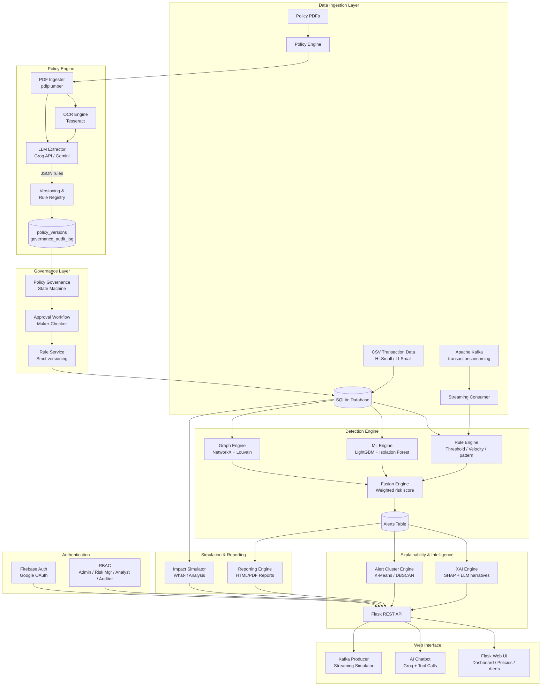

# 🛡️ Arabyo — Intelligent AML & Financial Crime Detection Platform

<div align="center">


**A production-grade, AI-powered Anti-Money Laundering (AML) and Financial Crime Compliance platform with end-to-end policy extraction, ML-based risk scoring, graph analytics, real-time streaming, and explainable AI.**

[Features](#-features) · [Architecture](#-system-architecture) · [Quick Start](#-quick-start) · [Modules](#-module-reference) · [API Reference](#-api-reference) · [Configuration](#-configuration)

</div>

---

## 📋 Table of Contents

1. [Project Overview](#-project-overview)
2. [Key Features](#-key-features)
3. [System Architecture](#-system-architecture)
4. [Project Structure](#-project-structure)
5. [Quick Start Guide](#-quick-start-guide)
6. [Module Reference](#-module-reference)
7. [API Reference](#-api-reference)
8. [Configuration & Environment Variables](#-configuration--environment-variables)
9. [Data Model](#-data-model)
10. [Policy Engine Deep Dive](#-policy-engine-deep-dive)
11. [Detection Pipeline Deep Dive](#-detection-pipeline-deep-dive)
12. [Governance & Compliance Lifecycle](#-governance--compliance-lifecycle)
13. [Real-Time Streaming](#-real-time-streaming-kafka)
14. [Impact Simulation](#-impact-simulation)
15. [Executive Reporting](#-executive-reporting)
16. [Authentication & RBAC](#-authentication--rbac)
17. [Deployment](#-deployment)
18. [Dataset](#-dataset)

---

## 🎯 Project Overview

**Arabyo** is a regulator-grade financial crime compliance platform built for financial institutions (banks, fintechs, payment processors) that need to:

- **Automatically extract** AML/KYC rules from regulatory PDF documents using LLM-powered semantic parsing
- **Detect suspicious transactions** using a 3-layer fusion engine: rules, ML (LightGBM + Isolation Forest), and graph analytics (NetworkX/Louvain)
- **Explain every alert** with SHAP-powered, human-readable risk breakdowns (Explainable AI)
- **Manage the full policy lifecycle** from draft to active with maker-checker governance workflows
- **Stream transactions in real time** via Apache Kafka for sub-second risk scoring
- **Simulate policy changes** before going live — quantify alert volume/severity impact
- **Generate enterprise PDF reports** for regulators and C-suite executives

Arabyo was built as a hackathon MVP with **production-grade architecture** — versioned policies, immutable audit trails, RBAC with Firebase Auth, and a clean REST API surface.

---

## ✨ Key Features

| Domain | Features |
|---|---|
| 🤖 **AI Policy Extraction** | LLM (Groq/Gemini) + regex hybrid extraction from AML PDFs; OCR fallback for scanned docs |
| 🔍 **Multi-Layer Detection** | Rule engine + LightGBM ML + Isolation Forest + Graph centrality risk fusion |
| 💡 **Explainable AI (XAI)** | SHAP value analysis, risk driver narratives, clause-level policy citations |
| 📋 **Governance Lifecycle** | Draft → Pending Review → Approved → Active → Retired with maker-checker |
| 🌊 **Real-Time Streaming** | Apache Kafka consumer/producer, live transaction scoring pipeline |
| 📊 **Impact Simulation** | Pre-deployment what-if analysis for policy changes |
| 📄 **Executive Reporting** | HTML-to-PDF enterprise reports for alerts and policy summaries |
| 🔐 **Enterprise Auth** | Firebase Authentication with Admin, Risk Manager, Analyst, Auditor RBAC |
| 🕸️ **Graph Analytics** | NetworkX graph construction, Louvain community detection, centrality scoring |
| 💬 **AI Chatbot** | Context-aware compliance assistant with structured tool calls |
| 📈 **Alert Clustering** | ML-powered grouping of related alerts for efficient triage |

---

## 🏛️ System Architecture



### Data Flow Summary

```
PDF Policy Documents
       │
       ▼
  Policy Pipeline ──► LLM/Regex Extraction ──► Rule Registry ──► Governance Lifecycle
                                                      │
                                                      ▼
Transaction Data ──► Rule Engine ─────────────► Risk Fusion Engine ──► Alert Generation
                 ──► ML Engine   ─────────────►   (Weighted Score)         │
                 ──► Graph Engine ────────────►                             │
                                                                            ▼
                                                              XAI + SHAP Explanation
                                                                            │
                                                                            ▼
                                                              Dashboard / Reports / API
```

---

## 📁 Project Structure

```
Project/
├── app/
│   ├── auth/                    # Firebase Authentication & RBAC
│   │   ├── firebase_auth.py     # JWT verification, session management
│   │   └── middleware.py        # Route-level auth guards
│   │
│   ├── data_layer/              # Data ingestion & feature engineering
│   │   ├── loader.py            # CSV → SQLite loader (chunked, 5M+ rows)
│   │   └── feature_engineering.py  # Account-level AML features
│   │
│   ├── detection/               # Multi-layer detection engine
│   │   ├── rule_engine.py       # Threshold, velocity, cross-border rules
│   │   ├── ml_engine.py         # LightGBM + Isolation Forest training & scoring
│   │   ├── graph_engine.py      # NetworkX graph, Louvain community detection
│   │   ├── fusion.py            # Weighted risk score fusion
│   │   ├── explainability.py    # SHAP + LLM narrative generation
│   │   ├── alert_cluster_engine.py # ML alert clustering & pattern recognition
│   │   └── cluster_engine.py    # Account clustering utilities
│   │
│   ├── policy_engine/           # Policy intelligence module
│   │   ├── pipeline.py          # End-to-end PDF → rules pipeline orchestrator
│   │   ├── pdf_ingester.py      # PDF text extraction (pdfplumber)
│   │   ├── ocr_engine.py        # Tesseract OCR for scanned pages
│   │   ├── llm_extractor.py     # Groq API LLM extraction with JSON schema
│   │   ├── rule_parser.py       # Regex-based rule extraction fallback
│   │   ├── text_cleaner.py      # NLP text normalization
│   │   ├── schemas.py           # Pydantic models: ExtractedRule, RuleCondition
│   │   ├── rule_dsl.py          # Rule Domain-Specific Language & post-processing
│   │   ├── versioning.py        # PolicyRegistry, RuleRegistry, AuditLogger
│   │   ├── policy_governance.py # Governance state machine, Maker-Checker
│   │   ├── rule_service.py      # Strict rule-to-version lineage enforcement
│   │   ├── rule_set_manager.py  # Rule set activation & lifecycle
│   │   ├── approval_workflow.py # Governance approval request tracking
│   │   └── rule_diff.py         # Version diff comparison engine
│   │
│   ├── simulation/              # Impact simulation engine
│   │   ├── engine.py            # What-if policy change simulation
│   │   └── report_generator.py  # Simulation report data preparation
│   │
│   ├── reporting/               # Enterprise report generation
│   │   └── engine.py            # Alert & executive HTML/PDF report data
│   │
│   ├── streaming/               # Apache Kafka real-time streaming
│   │   ├── consumer.py          # Kafka consumer, live transaction scoring
│   │   ├── producer.py          # Kafka producer for transaction simulation
│   │   └── processor.py         # Real-time scoring pipeline
│   │
│   ├── jobs/                    # Background scheduled jobs
│   │   └── scheduler.py         # APScheduler: periodic re-scoring
│   │
│   ├── web/                     # Flask web application
│   │   ├── routes.py            # All REST API routes (~1700 lines)
│   │   ├── chatbot.py           # AI chatbot with tool-augmented LLM
│   │   ├── templates/           # Jinja2 HTML templates
│   │   │   ├── base.html        # Base layout with sidebar navigation
│   │   │   ├── dashboard.html   # Executive dashboard
│   │   │   ├── alerts.html      # Alert list & filtering
│   │   │   ├── alert_detail.html # Alert detail + XAI explanation
│   │   │   ├── policies.html    # Policy & rules management
│   │   │   ├── governance.html  # Policy governance lifecycle UI
│   │   │   ├── clusters.html    # Alert cluster visualization
│   │   │   ├── simulation.html  # Impact simulation UI
│   │   │   └── reports/         # Print-ready report templates
│   │   └── static/
│   │       └── css/style.css    # Dark-mode enterprise design system
│   │
│   ├── db.py                    # SQLite + psycopg2-compatible adapter
│   └── config.py                # Centralized configuration
│
├── demo_policies/               # Sample AML policy PDFs
│   ├── 01_AML_Core_Policy_Detailed.pdf
│   ├── 02_CrossBorder_Wire_Policy_Detailed.pdf
│   ├── 03_ML_Governance_Detailed.pdf
│   └── 04_Network_Graph_Anomalies_Detailed.pdf
│
├── Dataset/                     # IBM AML transaction datasets
│   ├── HI-Small_Trans.csv       # High-illicit small dataset
│   ├── HI-Small_accounts.csv
│   ├── LI-Small_Trans.csv       # Low-illicit small dataset
│   └── LI-Small_accounts.csv
│
├── data/                        # Runtime data (gitignored)
│   ├── compliance.db            # SQLite database
│   └── rules.json               # Extracted rules cache
│
├── models/                      # Trained ML model artifacts
├── policies/                    # Uploaded policy PDF storage
├── reports/                     # Generated report output
│
├── run.py                       # Application entrypoint
├── run_extraction.py            # Standalone policy extraction runner
├── run_pipeline.py              # Full detection pipeline runner
├── create_policies.py           # Demo policy PDF generator
├── load_small.py                # Dataset loader script
├── requirements.txt
├── .env.example
└── docker-compose.yml
```

---

## 🚀 Quick Start Guide

### Prerequisites

- Python 3.11+
- Git
- (Optional) [Tesseract OCR](https://github.com/tesseract-ocr/tesseract) for scanned PDFs
- (Optional) Apache Kafka for real-time streaming

### 1. Clone & Install

```bash
git clone https://github.com/your-org/Arabyo.git
cd Arabyo
python -m venv .venv
source .venv/bin/activate  # Windows: .venv\Scripts\activate
pip install -r requirements.txt
```

### 2. Configure Environment

```bash
cp .env.example .env
```

Edit `.env`:

```ini
# Required for LLM-based policy extraction (get from console.groq.com)
GROQ_API_KEY=gsk_your_key_here

# Disable Firebase auth for local development (use ?role= param instead)
FIREBASE_AUTH_DISABLED=true

# Optional: custom DB path
DB_PATH=data/compliance.db
```

### 3. Load the Dataset

Download the IBM AML Small datasets and place in `Dataset/`:

```bash
python load_small.py
```

### 4. Extract Policies from PDFs

```bash
# Generate demo policies (or upload your own PDFs)
python create_policies.py

# Run extraction pipeline (uses Groq LLM by default)
python run_extraction.py
```

### 5. Run the Full Detection Pipeline

```bash
python run_pipeline.py --skip-setup
```

### 6. Start the Web Dashboard

```bash
python run.py
# → http://localhost:5000
```

### 7. (Optional) Start Kafka Streaming

```bash
# Start Kafka (via Docker)
docker-compose up -d kafka

# Start streaming consumer
python -m app.streaming.consumer

# Simulate incoming transactions
python -m app.streaming.producer
```

---

## 📦 Module Reference

### `app/detection/` — Multi-Layer Detection Engine

| Module | Description |
|---|---|
| `rule_engine.py` | Evaluates all active rules (threshold, velocity, cross-border, dormant account, SWIFT format) against transactions. Returns `RuleViolation` objects. |
| `ml_engine.py` | Trains LightGBM classifier + Isolation Forest on account-level features. Returns risk probability per account. |
| `graph_engine.py` | Builds a directed transaction graph using NetworkX. Runs Louvain community detection and PageRank centrality to identify hub accounts. |
| `fusion.py` | Aggregates rule violations, ML risk scores, and graph risk into a weighted composite risk score. Generates final `Alert` objects with metadata. |
| `explainability.py` | Computes SHAP values for ML predictions. Invokes LLM to generate natural-language risk driver narratives with policy citations. |
| `alert_cluster_engine.py` | Clusters alerts using K-Means / DBSCAN on behavioral features. Identifies typologies (structuring, layering, smurfing). |

### `app/policy_engine/` — Policy Intelligence Module

| Module | Description |
|---|---|
| `pipeline.py` | Orchestrates the full PDF→rules pipeline: ingest → OCR → clean → LLM extract → validate → store |
| `llm_extractor.py` | Calls Groq API (OpenAI-compatible) with a structured JSON schema prompt to extract enforceable compliance rules |
| `rule_parser.py` | Regex fallback extractor for when LLM is unavailable (threshold, velocity, cross-border patterns) |
| `versioning.py` | `PolicyRegistry` + `RuleRegistry` + `AuditLogger` — immutable versioned storage for all policy artifacts |
| `policy_governance.py` | Finite state machine: `draft → pending_review → approved → active → retired`. Immutable history. |
| `rule_service.py` | Strictly enforces rule-to-policy-version lineage. All rules MUST be bound to a `version_id`. |
| `approval_workflow.py` | Maker-Checker enforcement: submitter cannot approve their own submissions |
| `schemas.py` | Pydantic v2 models: `ExtractedRule`, `RuleCondition`, `RuleSource`, `ExtractionResult` |

### `app/simulation/` — Impact Simulation Engine

Allows compliance officers to preview the effect of any proposed policy change before it goes live:
- Computes **delta alert volume** (how many more/fewer alerts)
- Analyzes **severity distribution shifts**
- Estimates **operational load** (investigator workload)
- Samples **example affected transactions**

### `app/streaming/` — Real-Time Kafka Pipeline

| Component | Topic | Description |
|---|---|---|
| Producer | `transactions.incoming` | Simulates new transaction events |
| Consumer / Scorer | `transactions.incoming` | Pulls transactions, scores in real-time |
| Alert Publisher | `alerts.generated` | Publishes scored alerts downstream |

### `app/reporting/` — Enterprise Reporting

- `generate_alert_report_data()` — Prepares alert-level report with XAI explanation, risk breakdown, audit trail
- `generate_executive_report_data()` — Global portfolio summary: alert trends, risk distribution, top-risk accounts
- Reports render as clean print-ready HTML (browser Print-to-PDF)

---

## 🔌 API Reference

### Alerts

| Method | Endpoint | Description |
|---|---|---|
| `GET` | `/api/alerts` | List alerts with pagination, filtering (status, severity, account) |
| `GET` | `/api/alerts/<id>` | Get single alert detail |
| `GET` | `/api/alerts/<id>/explain` | Fetch XAI explanation with SHAP values |
| `POST` | `/api/alerts/<id>/dismiss` | Dismiss an alert with reason |
| `POST` | `/api/alerts/<id>/escalate` | Escalate to senior analyst |
| `GET` | `/api/alerts/<id>/report` | Render alert PDF report |

### Policies & Rules

| Method | Endpoint | Description |
|---|---|---|
| `GET` | `/api/policies` | List all policy documents and rules |
| `POST` | `/api/policies/extract` | Upload & extract rules from PDF |
| `GET` | `/api/policies/<id>/rules` | Get rules for a specific policy |
| `POST` | `/api/rules/<id>/approve` | Approve a rule (Risk Manager) |
| `POST` | `/api/rules/<id>/reject` | Reject a rule |
| `POST` | `/api/policies/<id>/approve` | Approve a policy document |
| `POST` | `/api/policies/<id>/retire` | Retire a policy |
| `POST` | `/api/policies/<id>/delete` | Permanently delete a policy (Admin) |

### Governance

| Method | Endpoint | Description |
|---|---|---|
| `GET` | `/api/governance/versions` | List all policy versions with stats |
| `GET` | `/api/governance/versions/<id>` | Get specific version detail |
| `POST` | `/api/governance/versions/<id>/submit-review` | Submit draft for review |
| `POST` | `/api/governance/versions/<id>/approve` | Approve pending version (maker-checker) |
| `POST` | `/api/governance/versions/<id>/activate` | Activate approved version |
| `POST` | `/api/governance/versions/<id>/retire` | Retire active version |
| `POST` | `/api/governance/versions/<id>/rollback` | Rollback to previous version |
| `GET` | `/api/governance/versions/<id>/impact` | Pre-activation impact analysis |
| `GET` | `/api/governance/versions/<v1>/diff/<v2>` | Compare two versions |
| `GET` | `/api/governance/audit` | Governance audit trail |

### Analytics

| Method | Endpoint | Description |
|---|---|---|
| `GET` | `/api/clusters` | List alert clusters |
| `GET` | `/api/clusters/<id>` | Get cluster detail with member alerts |
| `GET` | `/api/graph/stats` | Transaction graph statistics |
| `GET` | `/api/simulation` | List simulation runs |
| `POST` | `/api/simulation/run` | Execute a new what-if simulation |
| `GET` | `/api/simulation/<id>/report` | Render simulation HTML report |

### System

| Method | Endpoint | Description |
|---|---|---|
| `POST` | `/api/chat` | AI chatbot interaction |
| `GET` | `/api/stats` | System-wide statistics for dashboard |
| `POST` | `/api/data/reload` | Trigger pipeline re-run |
| `GET` | `/api/audit/<policy_id>` | Policy audit trail |

---

## ⚙️ Configuration & Environment Variables

All configuration is managed through `.env` + `app/config.py`.

| Variable | Default | Description |
|---|---|---|
| `GROQ_API_KEY` | _(required for LLM)_ | Groq API key for LLM policy extraction |
| `GEMINI_API_KEY` | _(optional)_ | Google Gemini API key (alternative LLM) |
| `DB_PATH` | `data/compliance.db` | SQLite database path |
| `FIREBASE_AUTH_DISABLED` | `false` | Set `true` to disable auth for local dev |
| `FIREBASE_SERVICE_ACCOUNT_PATH` | `credentials/firebase-adminsdk.json` | Firebase Admin SDK credentials |
| `ADMIN_EMAILS` | _(empty)_ | Comma-separated admin email list |
| `RISK_MANAGER_EMAILS` | _(empty)_ | Comma-separated risk manager emails |
| `AUDITOR_EMAILS` | _(empty)_ | Comma-separated auditor emails |
| `KAFKA_BOOTSTRAP_SERVERS` | `localhost:9092` | Kafka broker address |
| `KAFKA_TOPIC_INCOMING` | `transactions.incoming` | Incoming transaction topic |
| `KAFKA_TOPIC_ALERTS` | `alerts.generated` | Output alerts topic |
| `ALERT_THRESHOLD` | `0.15` | Minimum fusion score to generate an alert |
| `TARGET_ALERT_VOLUME` | `10000` | Desired alert count for risk calibration |
| `SECRET_KEY` | _(dev key)_ | Flask session secret key |

---

## 🗄️ Data Model

### Core Tables

```sql
-- Transaction data (from IBM AML dataset)
transactions (
    id, from_bank, from_account, to_bank, to_account,
    amount_received, receiving_currency, amount_paid,
    payment_currency, payment_format, is_laundering,
    timestamp
)

-- Account-level features computed by ML engine
accounts (
    id, account_id, bank, total_sent, total_received,
    transaction_count, unique_counterparties, avg_amount
)

-- Generated alerts (with risk metadata)
alerts (
    id, account_id, alert_type, risk_score, severity,
    triggered_rules, ml_score, graph_score, status,
    created_at, dismissed_at, escalated_at
)

-- Policy documents (versioned)
policy_documents (
    id, policy_id, filename, version, checksum,
    raw_text, page_count, policy_status, uploaded_at
)

-- Governance versions (immutable)
policy_versions (
    version_id, policy_id, version_number, status,
    checksum_hash, source_document_uri, created_by,
    parent_version_id, rule_count, change_summary,
    approved_by, approved_at, effective_from, effective_to
)

-- Extracted rules (bound to version)
rules (
    id, version_id, name, source_document, source_page,
    source_text, rule_type, conditions, severity, version,
    status, confidence, review_required, ambiguous, rule_hash,
    policy_version, effective_date, is_deleted
)

-- Maker-Checker approval requests
governance_approvals (
    id, entity_type, entity_id, submitter, reviewer,
    status, comments, submitted_at, reviewed_at
)

-- Immutable governance audit trail
governance_audit_log (
    id, version_id, policy_id, action, old_status,
    new_status, details, performed_by, ip_address, created_at
)
```

---

## 📝 Policy Engine Deep Dive

The policy engine transforms unstructured regulatory PDFs into machine-executable compliance rules through a 6-stage pipeline:

```
PDF Input
   │
   ▼ Stage 1: Text Extraction (pdfplumber)
   ├── Extracts text per page with metadata (page number, bounding boxes)
   │
   ▼ Stage 2: Policy Registration (PolicyRegistry)
   ├── Computes SHA-256 checksum for deduplication
   ├── Assigns semantic version (v1.0, v1.1, ...)
   ├── Creates immutable policy_documents record
   │
   ▼ Stage 3: OCR (Tesseract, optional)
   ├── Detects scanned pages (image-heavy, low text density)
   ├── Runs Tesseract OCR to recover text from scanned pages
   │
   ▼ Stage 4: Text Cleaning
   ├── Removes headers, footers, page numbers
   ├── Normalizes whitespace, special characters
   ├── Segments into meaningful paragraphs
   │
   ▼ Stage 5: Rule Extraction (LLM primary / Regex fallback)
   ├── LLM Path: Sends cleaned text to Groq with structured JSON schema prompt
   │   ├── Forces rule_id, rule_name, conditions[], action, severity, confidence
   │   ├── Cross-validates numeric thresholds against source text
   │   └── Marks ambiguous rules for human review
   ├── Regex Path: Pattern-matches thresholds, velocity limits, jurisdiction rules
   │
   ▼ Stage 6: Post-Processing & Storage
   ├── Deduplicates by rule_id
   ├── Runs ambiguity checks and sanity validation
   ├── Creates governed PolicyVersion container (PolicyGovernance.create_version)
   └── Saves via RuleService with strict version lineage
```

### Rule Condition Schema

Each extracted rule has typed, machine-executable conditions:

```json
{
  "rule_id": "AML-001",
  "rule_name": "Large Cash Transaction Report",
  "rule_type": "threshold",
  "conditions": [
    {
      "metric": "transaction_amount",
      "operator": ">=",
      "value": 10000,
      "currency": "USD"
    }
  ],
  "action": "report",
  "severity": "high",
  "confidence": 0.95,
  "source_text": "All cash transactions exceeding $10,000 must be reported..."
}
```

---

## 🔍 Detection Pipeline Deep Dive

### Layer 1 — Rule Engine

Tests every transaction/account against all active rules. Supports:
- **Threshold rules**: `amount >= 10000`
- **Velocity rules**: `transaction_count > 20 WITHIN 24 hours`
- **Cross-border rules**: high-risk jurisdiction flags
- **Pattern rules**: round-number detection, structuring patterns
- **Dormant account rules**: sudden activity after inactivity period

### Layer 2 — Machine Learning Engine

- **Features**: 25+ account-level features (total volume, counterparty diversity, time-of-day patterns, currency entropy)
- **Classifier**: LightGBM (gradient boosted trees) trained on IBM AML ground truth labels
- **Anomaly Detector**: Isolation Forest for zero-label anomaly detection
- **Output**: Risk probability per account (0.0 — 1.0)

### Layer 3 — Graph Engine

- **Graph**: Directed weighted multigraph of all transactions (accounts = nodes, transactions = edges)
- **Community Detection**: Louvain algorithm identifies closely-knit money circulation clusters
- **Centrality**: PageRank and betweenness centrality scores hub accounts (potential layering nodes)
- **Risk boost**: Accounts in high-risk communities receive `CLUSTER_RISK_BOOST` uplift

### Risk Fusion

```python
fusion_score = (
    rule_weight    * rule_risk_score    +  # 0.40
    ml_weight      * ml_risk_score      +  # 0.35
    graph_weight   * graph_risk_score   +  # 0.25
)
# Alert generated if fusion_score >= ALERT_THRESHOLD (default: 0.15)
```

---

## 🛡️ Governance & Compliance Lifecycle

Arabyo enforces a strict, regulator-friendly policy lifecycle with an immutable audit trail:

```
┌────────┐   Submit    ┌────────────────┐   Approve   ┌──────────┐
│ DRAFT  │ ──────────► │ PENDING_REVIEW │ ──────────► │ APPROVED │
└────────┘             └────────────────┘             └──────────┘
    ▲                         │ Reject                      │ Activate
    │◄────────────────────────┘                             ▼
    │ Rollback                                          ┌────────┐
    │◄──────────────────────────────────────────────── │ ACTIVE │
                                                       └────────┘
                                                            │ Retire
                                                            ▼
                                                       ┌─────────┐
                                                       │ RETIRED │
                                                       └─────────┘
```

- **Maker-Checker**: The user who submits for review cannot approve it
- **Immutable History**: Status transitions are logged in `governance_audit_log` and never deleted
- **Version Integrity**: SHA-256 checksum on every policy version
- **Rollback**: Creates a new version (never mutates history)

---

## 🌊 Real-Time Streaming (Kafka)

```
                    ┌──────────────────────────────────┐
┌──────────────┐    │         Kafka Cluster             │    ┌──────────────┐
│  Transaction │    │  ┌──────────────────────-──-──┐   │    │  Compliance  │
│  API / App   │───►│  │  transactions.incoming      │   │    │  Dashboard   │
└──────────────┘    │  └───────────┬──────────────-─┘   │    └──────┬───────┘
                    │              │                     │           │
                    │              ▼                     │           │
                    │  ┌──────────────────████──────┐   │    ┌──────┴───────┐
                    │  │  Streaming Consumer        │   │    │  alerts.     │
                    │  │  (Rule + ML scoring)       │───►│    │  generated   │
                    │  └────────────────────────────┘   │    └──────────────┘
                    │  ┌──────────────────────────────┐ │
                    │  │  transactions.scored          │ │
                    │  └──────────────────────────────┘ │
                    └──────────────────────────────────-─┘
```

---

## 📊 Impact Simulation

Before activating a new policy version, compliance teams can run **what-if simulations**:

1. Select proposed rule changes (new thresholds, new rules, removed rules)
2. Simulator re-evaluates historical transactions against the proposed ruleset
3. Reports delta: `+320 alerts (↑12%)`, `severity_high: +45`, `workload_hours: +18.5`
4. Export simulation results as an HTML/PDF report for management sign-off

---

## 📄 Executive Reporting

Two report types are supported, rendered as clean, print-ready HTML:

### Alert Report (`/alerts/<id>/report`)
- Alert metadata (account, risk score, severity)
- Risk driver breakdown (rule violations, ML factors, graph factors)
- AI-generated narrative explanation
- SHAP feature importance chart
- Policy citations (which rule triggered this alert and its source clause)
- Audit trail

### Executive Portfolio Report (`/api/reports/executive`)
- Portfolio summary (total alerts, critical count, escalation rate)
- Risk trend over time
- Top 10 risky accounts
- Alert severity distribution
- Compliance posture score

---

## 🔐 Authentication & RBAC

Arabyo uses Firebase Authentication with 4 built-in roles:

| Role | Capabilities |
|---|---|
| **Admin** | Full access: create/delete policies, wipe data, manage users |
| **Risk Manager** | Approve/retire policies and rules, escalate alerts, run simulations |
| **Analyst** | View alerts, run investigations, add notes, view reports |
| **Auditor** | Read-only access to all data including audit logs |

### Development Mode

Set `FIREBASE_AUTH_DISABLED=true` in `.env` to skip Firebase authentication. Routes use the `?role=admin|risk_manager|analyst|auditor` query parameter for role simulation during development.

### Production Setup

1. Create a Firebase project at [console.firebase.google.com](https://console.firebase.google.com)
2. Download the Admin SDK service account JSON → place at `credentials/firebase-adminsdk.json`
3. Configure Google Sign-In in the Firebase Console
4. Set `ADMIN_EMAILS`, `RISK_MANAGER_EMAILS`, `AUDITOR_EMAILS` in `.env`
5. Set `FIREBASE_AUTH_DISABLED=false`

---

## 🐳 Deployment

### Local Development

```bash
python run.py
```

### Docker Compose (with Kafka)

```bash
docker-compose up -d
```

The `docker-compose.yml` starts:
- **Zookeeper** (Kafka dependency)
- **Kafka** broker
- **Arabyo** Flask app

### Production (Gunicorn)

```bash
pip install gunicorn
gunicorn -w 4 -b 0.0.0.0:5000 "run:create_app()"
```

### Environment Checklist for Production

- [ ] Set strong `SECRET_KEY`
- [ ] Set `FIREBASE_AUTH_DISABLED=false`
- [ ] Configure `ADMIN_EMAILS`, `RISK_MANAGER_EMAILS`
- [ ] Store `firebase-adminsdk.json` securely (not in repo)
- [ ] Set `GROQ_API_KEY` for LLM extraction
- [ ] Configure Kafka connection strings
- [ ] Use a persistent database (PostgreSQL recommended for scale)

---

## 📂 Dataset

Arabyo is pre-integrated with the **IBM AML Synthetic Dataset**:

| Dataset | Transactions | Illicit Rate | Size |
|---|---|---|---|
| HI-Small | ~5.1M | ~0.2% (high-illicit) | ~750MB |
| LI-Small | ~1.2M | ~0.01% (low-illicit) | ~180MB |

**Download**: [IBM AML Dataset on Kaggle](https://www.kaggle.com/datasets/ealtman2019/ibm-transactions-for-anti-money-laundering-aml)

Place files in `Dataset/`:
```
Dataset/
├── HI-Small_Trans.csv
├── HI-Small_accounts.csv
├── LI-Small_Trans.csv
└── LI-Small_accounts.csv
```

---

## 🧪 Testing

```bash
# Test the governance module
python test_governance.py

# Test the policy engine
python test_policy_engine.py

# Test the AI explanation engine
python test_genai.py

# Test alert clustering
python test_clusters.py
```

---

## 📜 License

This project is licensed under the MIT License. See [LICENSE](LICENSE) for details.

---

## 🙏 Acknowledgments

- **IBM Research** for the AML synthetic transaction dataset
- **Groq** for blazing-fast LLM inference
- **SHAP** for model explainability
- **NetworkX** & **python-louvain** for graph analytics
- **LightGBM** for gradient-boosted ML
- **Flask** for the web framework

---

<div align="center">

Built with ❤️ for Hackspace 2.0 · **Arabyo** — Making AML Compliance Intelligent

</div>
